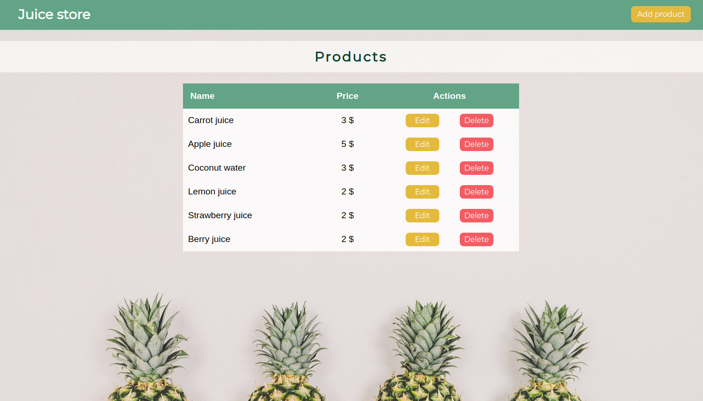

# CRUD-REDUX-SAGA



## Introduction

Simple products CRUD developed to learn React Redux with redux-saga.

## Functional Description

A user can:
- Create
- Read
- Update
- Delete

## Technical Description

- Frontend: React with redux-saga, CSS-SASS
- Backend: json-server

## Usage

**Prerequisites:**

- Install [Node.js](https://nodejs.org/es/) if you haven't yet. Npm is needed but is included installing Node.js.

**Next steps:**

- Install globally the fake API server [json-server](https://github.com/typicode/json-server) I used to focalize in Redux:
```
npm install -g json-server
```

- Download or clone the repository in your local (https://github.com/diana-moreno/crud-redux-saga.git).

- Install dependencies running the command:
```
npm install
```

**Running:**

You need to keep opened 2 terminal windows at the same time.

1- The frontend with React:
```
npm run start
```

2- The backend with json-server:
```
json-server --watch db.json --port 4000
```
